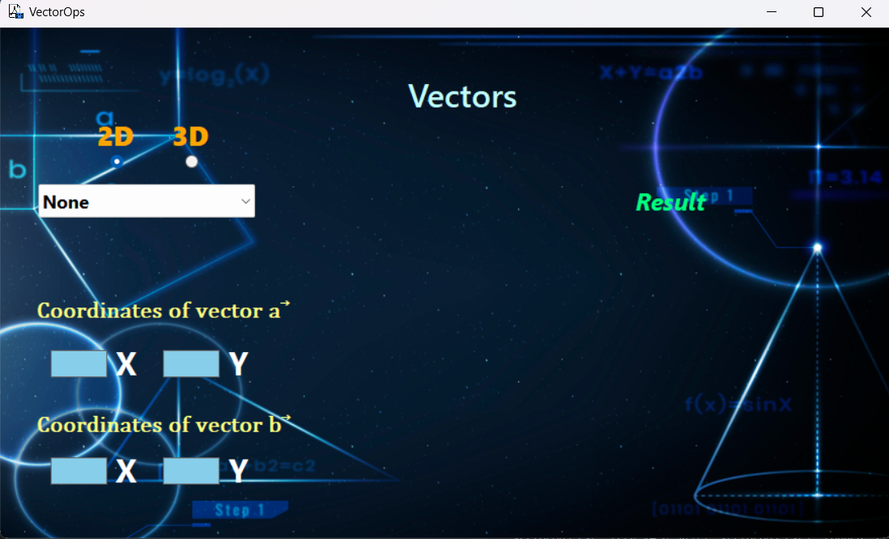

# VectorOps
C# Windows Forms Application for performing 2D and 3D vector operations, including addition, subtraction, magnitude calculation, dot product, cross product, and vector rotation. Includes an animated visualization of vector rotation for enhanced understanding.
Main interface look like in image below:

