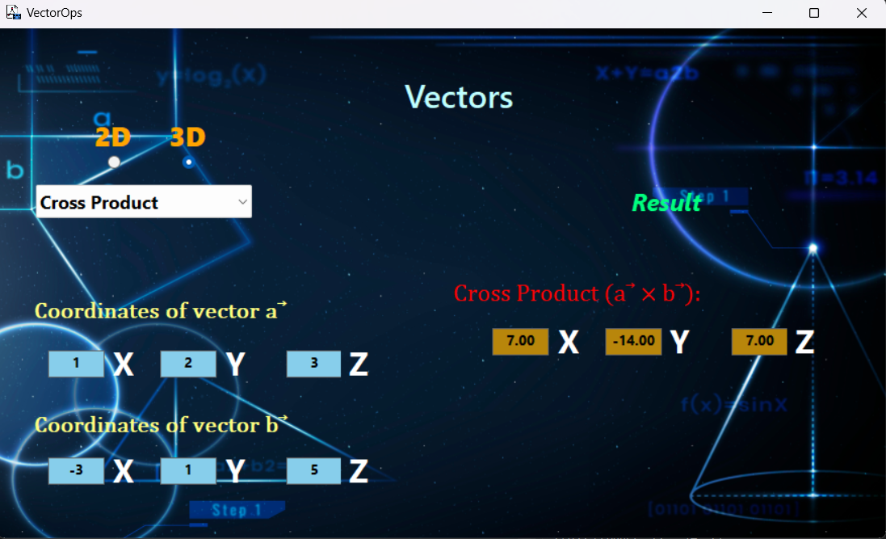
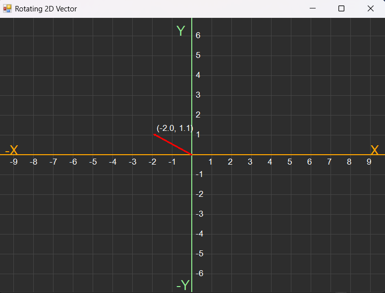

# VectorOps
C# Windows Forms Application for performing 2D and 3D vector operations, including addition, subtraction, magnitude calculation, dot product, cross product, and vector rotation. Includes an animated visualization of vector rotation for enhanced understanding.

Main interface look like in image below:

This Windows Forms application performs various operations on 2D and 3D vectors, including:
  -Addition – Computes the sum of two vectors.
  -Subtraction – Computes the difference between two vectors.
  -Vector Magnitude – Calculates the length of a vector.
  -Dot Product – Determines the scalar product of two vectors.
  -Cross Product – Computes the vector perpendicular to two 3D vectors.
  -Vector Rotation – Rotates a vector by a specified angle, with an animation.
  
  
The application provides an interactive interface for visualizing and manipulating vectors.For see more how work app plese see video from Assets "Demo_WorkApp".
